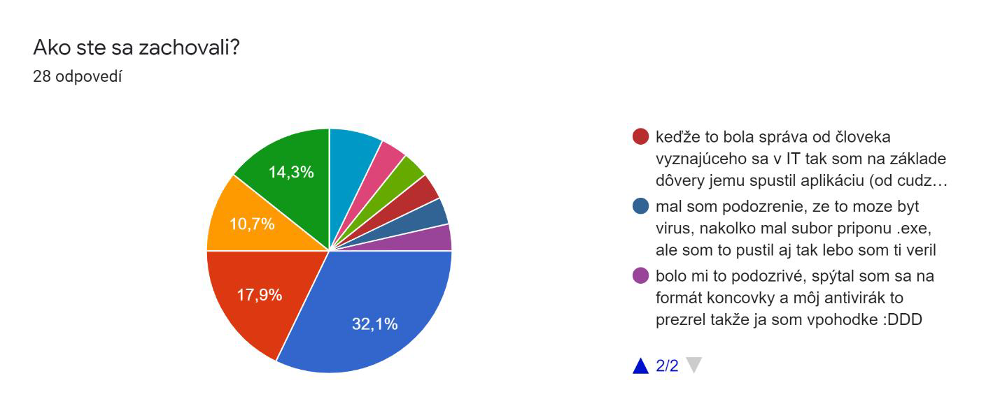
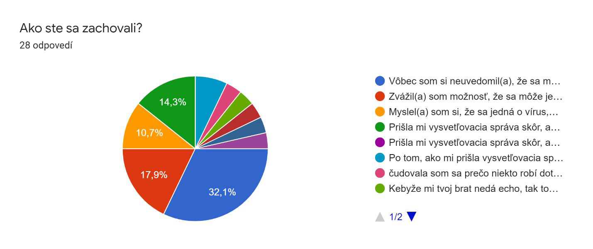

# VŠEOBECNÁ MYŠLIENKA
## Útok
Na účel tohto projektu som sa rozhodol simulovať útok na svoju osobu, konkrétne na môj Facebook (a Messenger) účet. V tejto simulácii sa jedná o to, že moja ochrana Facebook účtu bola prelomená, a útočník získal plný prístup k môjmu účtu. Následne sa rozhodol svoj malware šíriť cez súkromné správy.

## Cieľ
Môj cieľ je zvýšiť povedomie o internetových útokoch, a upozorniť na jeho možnosť u hocikoho. Preto som aj vytvoril informačnú stránku, kde úvadzam tipy čo robiť, aby sa človek vyhol kybernetickému útoku, alebo čo robiť, ak už je napadnutý.

## Sprievodná správa
Asi najdôležitejšia časť, ktorá zaručí úspech alebo neúspech útoku je samotná správa, ktorá má presvedčiť obeť, aby si škodlivý software stiahla a spustila.

Najprv som chcel použiť anglickú správu, ktorú by som preložil pomocou Google prekladača do slovenského jazyka, ale v slovenčine sa používajú zámená “ty/vy“, zatiaľ čo v angličtine existuje iba “you”. Toto vytvorilo pomerne veľký problém, pretože správa znela nereálne, preto som sa rozhodol vytvoriť správu v slovenčine.

Nechcel som, aby správa bola typická pre internetové podvody (ktoré môžu slúžiť na šírenie škodlivého software-u) typu “zrýchli si počítač pomocou tohto programu zadarmo”, “vyhraj iphone”, “stiahni si viac RAM” …

Keďže má útočník prístup k môjmu Facebook účtu, mohol som v správe použiť informáciu o tom, že pracujem na nejakom projekte do školy a takto správu personalizovať.

“Ahoj, pracujem na projekte do školy na kvíze. Potreboval by som ho otestovať, a získať tak nejakú spätnú väzbu. Preto ocením, ak si nájdeš chvíľku na jeho otestovanie. Kvíz zaberie maximálne 5 minút, a na konci je dotazník, ktorý nezaberie viac ako minútu. Súbor treba najprv rozbaliť, heslo je 1234. Ďakujem. https://filebin.net/aqrxydpyp3i13ih5”

## Názov program
Ako som vyššie uviedol, nechcel som použiť scam názov, preto som sa rozhodol, že použijem scenár, kde som pracoval na projekte do školy na vytvorene kvíz aplikácie.

## Prenos súboru
Kvôli zvýšeniu bezpečnosti sa nedajú vytvoriť programy, ktoré sa po stiahnutí sami spustia. Snažil som sa nájsť nejaké riešenie na toto, ale kvôli útokom a šíreniu škodlivého software-u sa takéto niečo nedá jednoducho spraviť, preto som musel obeť presvedčiť, aby si aplikáciu stiahla, a následne aj spustila sama.

Druhý problém, ktorý som musel vyriešiť bol, ako poslať veľkému počtu ľudí jeden program, konkrétne typu .exe. Moje prvé pokusy ukázali, že takýto program sa nedá jednoducho šíriť pomocou súkromných správ – Messenger nepodporuje posielanie spustiteľných súborov. Kvôli tomuto som sa rozhodol svoj program zabaliť do archívu, konkrétne do formátu .rar. Teraz som už mohol svoj program rozposlať komu som chcel.

Ďalší problém bol, že internetové prehliadače skenujú sťahované súbory, a preto rýchlo odhalia, že sa v archíve nachádza spustiteľný program, a používateľa na takúto hrozbu upozorní. Zistil som ale, že je možné na archív pridať heslo, čím sa zašifrujú údaje vnútri, a prehliadač tak stratí možnosť získať hocijaké informácie o súboroch, ktoré sa v archíve nachádzajú.

Teraz som už mohol rozposielať súbor hocikomu bez obavy, že ich prehliadač upozorní na potenciálnu hrozbu. Nakoľko som ale chcel poslať program čím viac ľuďom, nebolo by veľmi praktické ho posielať každému samostatne, preto som ho nahral na stránku tretej strany, ktorá povoľuje voľné šírenie súborov, a ukladanie obsahu až na týždeň, kedy sa hocikto s linkom na daný repozitár môže k nemu dostať a súbor si stiahnuť. 

## Upozornenie všetkých
Pre ideálnu simuláciu som sa rozhodol, že po približne dvoch hodinách od rozposlania malware-u do súkromných správ pošlem všetkým akúsi vysvetľovaciu správu – ako keby som sa práve prihlásil do svojho účtu, a všimol si, že cez moje konto bol práve masívne rozposlaný vírus.

Táto správa je: “Toto je vopred vytvorená generická správa, nakoľko som do tohto projektu zapojil príliš veľké množstvo ľudí. Aplikácia, ktorú som vám vyššie poslal je v skutočnosti simulácia vírusu. Pre podrobnejšie vysvetlenie o tomto projekte si spustite aplikáciu (ktorá vám otvorí linky), alebo navštívte priamo adresu: https://github.com/Mahrkeenerh/RansomwareAwareness/tree/master/Info“

Mojim cieľom bolo aspoň v skratke vysvetliť, o čo sa jedná, a presmerovať všetkých na github repozitár, kde bola simulácia bližšie vysvetlená aj spolu s radami, ako sa útokom vyhýbať. Myslím si ale, že táto správa odradila pomerne veľké množstvo ľudí od toho, aby link navštívili z dôvodu, že už v ňom bolo čiastočne vysvetlené, o čo sa jedná, a tiež tam bol spomenutý vírus a link na stránku spolu.

# TVORBA PROGRAMU
## Šifrovací program
Na začiatku som mal v pláne vytvoriť program, ktorý by šifroval údaje, teda prototyp nejakého reálneho ransomware-u. Tento program by zašifroval niektoré dôležité údaje, napríklad používateľské dokumenty, a následne by vypísal správu, že vykonal takúto akciu a otvoril link na druhú aplikáciu, ktorá by po spustení tieto zašifrované údaje odšifrovala.

Problém ale je, že takáto aplikácia je reálne ransomware, alebo aspoň časť z neho – šifruje údaje používateľovi. Toto je ale nelegálne, a preto som musel od tohto prototypu upustiť.

## Dummy files
Druhý prototyp, ktorý som chcel vytvoriť je – program, ktorý vytvorí na náhodných miestach na disku akési “dummy files”, teda súbory, ktoré nemajú žiaden účel, a sú prázdne. Takýto program by nijako nemodifikoval používateľské súbory, ani by neobmedzil prístup k dátam, iba by vytvoril súbory, a vypísal cestu k nim (kde sa nachádzajú). Následne by používateľ mohol spustiť druhý program, do ktorého by tieto cesty zadal, a on by všetky súbory vymazal, teda pre daného človeka by to bolo takmer bezstarostné.

Problém ale je s menej technicky zdatnými osobami – keďže by im program vytvoril prázdne súbory na náhodných miestach na disku, mohli by nadobudnúť predstavu, že im program prečítal obsah disku, a na tom základe vytvoril tieto súbory (čo ale nie je pravda, ale je jednoduchšie vytvoriť program bez niečoho podobného, ako to vysvetľovať širšiemu publiku).

## Obsah disku
Tretia možnosť, ktorá mi napadla bola, že program vypíše do textového súboru celý obsah disku. Na tomto prototype som aj viac pracoval, a pomocou programovacieho jazyku c sa mi podarilo takýto program vytvoriť. C-čkový skript spustil konzolu, v ktorej následne vykonal príkaz na rekurzívny výpis obsahu priečinkov, ktorý bol presmerovaný do textového výstupu do externého súboru. Takýto súbor, ktorý obsahoval cestu ku všetkým súborom na disku mal veľkosť až niekoľko gigabyte-ov pri mojom testovaní.

Prvý problém teda je reálna veľkosť, nie všetci môžu mať toľko voľného priestoru. Druhý problém je rovnaký ako pri druhom prototype – menej technicky zdatné osoby môžu znovu nadobudnúť pocit, že program im prečítal celý obsah disku.

## Otváranie linkov

Štvrtý a finálny prototyp programu bol najjednoduchší, aby nevytvoril žiadne problémy. Program má jediný cieľ – otvoriť linky v internetovom prehliadači. Z tohto dôvodu som sa rozhodol namiesto programovacieho jazyku c použiť Python pre jeho jednoduchosť. Na možné spustenie aj bez jeho knižníc (bez toho, aby bola na počítači nainštalovaná ľubovoľná verzia Python-u) som použil auto-py-to-exe. Táto aplikácia je jednoduchá, a slúži presne na potrebné účely – vytvorí .exe program z python kódu. Problém ale bol, že som si dostatočne nenaštudoval požiadavky na Linux a MacOS, preto môj prototyp malware-u nebolo možné na týchto operačných systémoch spustiť.

Tento štvrtý model programu vykoná len dve akcie – otvorí jeden link, na ktorom sa nachádza dotazník, a druhý link, ku github repozitáru, kde sú dostupné informácie pre napadnutú osobu.

# VYHODNOTENIE DOTAZNÍKA
## Obsah
Dotazník obsahoval len jednu otázku – ako sa daný človek zachoval v tejto situácii.

## Výsledky
Malware som dokopy poslal viac ako 100 ľuďom cez Messenger, dotazník vyplnilo 28 ľudí (väčšina ešte predtým, ako som po dvoch hodinách poslal vysvetľovaciu správu).

Až 32% si vôbec neuvedomilo, že sa môže jednať o nejaký vírus, a aplikáciu si stiahli a následne spustili. To znamená, že celých 32% by okamžite stratilo prístup ku svojim údajom.

Až 36% zvážilo, že by sa mohlo jednať o vírus, ale aplikáciu si aj tak spustili. Či už z dôvodu, že verili zdroju (mne), alebo verili svojmu antivírusu, ktorý najprv nechali, aby aplikáciu skenoval a zistil, či sa jedná o potenciálnu hrozbu. Problém pri tomto ale je, že útočník mohol bez problémov vygenerovať správu, ako som vytvoril ja vyššie (na základe súkromných, alebo aj verejných údajov o mne), preto argument, že verili zdroju od koho aplikácia prišla padá.

14% si nestihlo aplikáciu spustiť predtým, ako im prišla vysvetľovacia, ale uviedli, že keby im druhá správa neprišla, alebo by mali čas skôr, aplikáciu by si spustili.

7% uviedlo, že si spustili aplikáciu až po tom, ako im prišla vysvetľovacia správa. Toto mohla byť ale tiež správa od útočníka, ktorý sa pokúša zlepšiť si šancu na infikovanie čím viac počítačov.

Iba 11% z opýtaných označilo odpoveď, že aplikáciu si vôbec nespustili.

# Záver
Nakoľko dotazník vyplnila iba približne štvrtina opýtaných, môžem sa vyjadrovať iba k nim, a z tohto vyvodiť nejaký záver, ktorý ale nemusí odrážať reálnu situáciu, kvôli slabej účasti na dotazníku.

Zo získaných údajov vyplíva, že až 89% ľudí by si škodlivú aplikáciu spustili, a jediné, čo by niektorých mohlo zachrániť, je dobré načasovanie – práve sú v práci, kde nemôžu spúšťať/sťahovať náhodný obsah alebo operačný systém, ktorý nepodporuje daný formát aplikácie.

Iba 11%, teda traja ľudia uviedli, že by si aplikáciu nespustili. Od týchto ľudí mi prišla otázka (po obdržaní linku na program), či by som im mohol potvrdiť, že sa nejedná o škodlivý software, alebo či by som im mohol bližšie špecifikovať, o čo sa jedná, ináč si aplikáciu nespustia. 

# ZDROJE
1.	Samuel Bubán: RansomwareAwareness 2.3.2021
https://github.com/Mahrkeenerh/RansomwareAwareness
